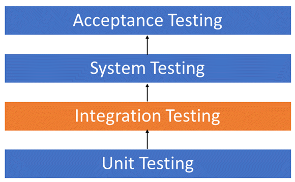

# Fluent Scaffold
Fluent Scaffold is intended to help with setting up test data for Integration Tests. 
It allows you to build a Test Scaffold using a fluent API of predefined builders to seed data or initialise services.

## Why?


We often mistake Integration Tests for Unit tests. Integration tests are intended to test the behaviour of multiple components working together. 

These are generally higher level components that together make aup a more complicated workflow. 
Due to the complexity of dependant services relying on specific data structures we ofter mock these services instead.
This can often cause False Positives or mis bugs unless you mock the service to response exactly the same as it would for all variations that it is called with

By setting up the Data Structures in a way that they test would expect we can initialize the dependant services in the same manor or with minimal mocking to give a better representation of how your code will run in production.

## Example

```csharp
    [Test]
    public void ComponentIntegrationTest_UserCanAddToCart()
    {
        using var dbContext = TestDbContextFactory.Create();

        var email= "Jim@test.com";
        var password = "SupperSecretPa$$word";
        
        // Arrange
        var userId = Guid.Parse("A5A743C3-A02F-4CA3-94F8-B0ECAF4A6345");
        var testScaffold = new TestScaffold()
            .EfCoreBuilder(dbContext)
            .WithDefaultCatalogue()
            .With(new User(
                id: userId,
                email: email,
                password: password,
                name: "Jimmy",
                dateOfBirth: DateOnly.FromDateTime(DateTime.Now.AddYears(-8))
            ))
            .WithShoppingCart(userId)
            .Build()
            .AutofacBuilder()
            .WithSingletonTypeAs<AuthService, IAuthService>()
            .WithContainerBuilder(builder =>
                builder.Register(c =>
                    {
                        // Mock an Authenticated User Context
                        return new UserContext(c.Resolve<IAuthService>(), email, password);
                    })
                    .As<IUserContext>()
                    .InstancePerLifetimeScope()
            )
            .WithType<ShoppingCartService>()
            .Build();

        var item = dbContext.Items.FirstOrDefault(i => i.Title == Defaults.CatalogueItems.DeadPool);

        

        // Act
        var shoppingCartService = testScaffold.Resolve<ShoppingCartService>();
        shoppingCartService.AddItemToCart(item!.Id);

        // Assert 
        
        var cart = dbContext.ShoppingCart.Include(s => s.Inventory).FirstOrDefault(u => u.UserId == userId);
        Assert.IsTrue(cart?.Inventory.Any(i => i.Id == item.Id));
    }
```
## Builders
Builders enabled the Fluent API and control the Setup for the specific framework the builder is Designed for. 

```csharp
        var testScaffold = new TestScaffold()
            .EfCoreBuilder(dbContext)
            .With(new User(
                id: userId,
                email: email,
                password: password,
                name: "Jimmy",
                dateOfBirth: DateOnly.FromDateTime(DateTime.Now.AddYears(-8))
            ))
            .Build();
            
        var testScaffold = new TestScaffold()
            .AutofacBuilder()
            .WithSingletonTypeAs<AuthService, IAuthService>()
            .Build()
```
Builders ues deferred execution until the `.Build()` method is called. This will also return the Fluent API back to the `TestScaffold` to allow continuing with other builders. 

## IOC 
Fluent Scaffold contains it's own IOC. By default this uses .net cores `IServiceProvider` and `ServiceCollection`

`FluentScaffold.AutoFac` is an example of how you can initialise your Test Scaffold using AutoFac instead.

```csharp
        //Register service as instance per lifetime scope using autofac builder.
        var testScaffold = new TestScaffold()
            .AutofacBuilder()
            .WithContainerBuilder(builder =>
                builder.RegisterType<TimeService>().As<ITimeService>().InstancePerLifetimeScope())
            .Build();


        var timeService1 = testScaffold.Resolve<ITimeService>();
        var timeService2 = testScaffold.Resolve<ITimeService>();

        Assert.Multiple(() =>
        {
            Assert.NotNull(timeService1);
            Assert.NotNull(timeService2);

            //should return the same object reference 
            Assert.AreSame(timeService1, timeService2, "Object reference should match for InstancePerLifetimeScope.");
        });
```

See Tests for more examples. 

## Entity Framework Builder

The EF Builder allows you to initialize your database using Entity Framework Core. 

```csharp
    [Test]
    public void EBBuilder_Can_Extend_EfBuilder()
    {   
        using var dbContext = TestDbContextFactory.Create();
        var userId = Guid.Parse("36A6736A-F8AC-4FA2-B33E-0ACB14776C0F");
        new TestScaffold()
            .EfCoreBuilder(dbContext)
            .WithDefaultCatalogue()
            .With(new User(
                id:userId,
                email : "Bob@test.com",
                password: "",
                name : "Bob", 
                dateOfBirth: DateOnly.FromDateTime(DateTime.Now.AddYears(-15))
            ))
            .WithShoppingCart(userId)
            .Build();

        var user = dbContext.Users.FirstOrDefault(u => u.Id == userId);
        var shopping = dbContext.ShoppingCart.FirstOrDefault(s => s.User.Id == userId);
        var items = dbContext.Items.ToList();
        
        Assert.Multiple(() =>
        {
            //User Added to dbContext
            Assert.IsNotNull(user);
            Console.WriteLine($"Matched User:{user?.Id}, Expected User: {userId}");
            Assert.IsTrue(user?.Id == userId, "User not found");

            //Shopping Cart Added to DBContext
            Assert.IsNotNull(shopping);
            
            //Default items added to DBContext
            Assert.IsTrue(items.Count == 3, "Item count did not match");
        });
    }
```

See Tests for more examples. 

### Custom EF Builder methods

Custom builders are extension methods that contain predefined data structures that allow your to quickly insert common data
In this example we now a Shopping Cart requires a UserId so we can create a builder method for it to quickly setup shopping carts

**It's convention to start builder methods with the `With` prefix**
```csharp
    /// <summary>
    /// Adds a Shopping cart for the User
    /// </summary>
    public static EfCoreBuilder<TDbContext> WithShoppingCart<TDbContext>(
        this EfCoreBuilder<TDbContext> builder,  Guid userId) where TDbContext: DbContext
    {
        builder.With(new ShoppingCart()
        {
            Id = Guid.NewGuid(),
            UserId = userId
        });
        
        return builder;
    }
```